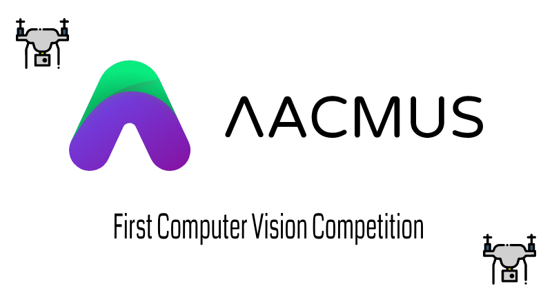
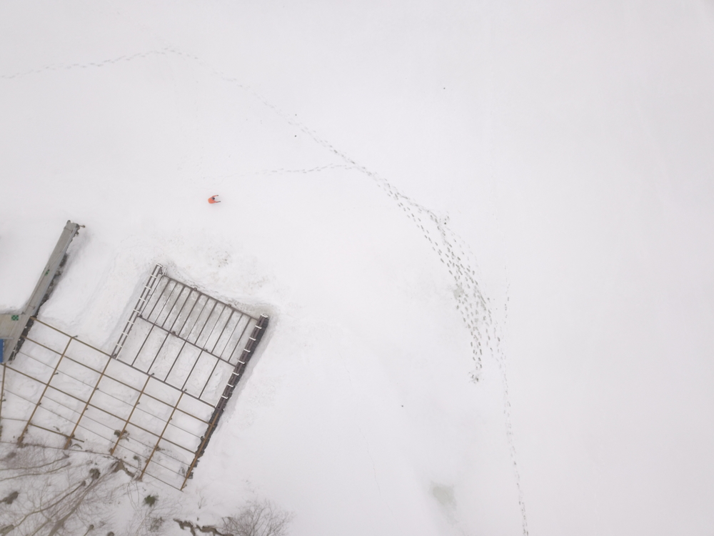

# 1st Lacmus Computer Vision Competition (July 2021)



*Lacmus Foundation - Finding Missing People With Neural Networks. Fast. User-Friendly. OpenSource.*

## Description

Every person going outdoors has a chance to get lost. Usually people get lost in the forest and wilderness. About 120 000 Persons are lost In Russia every year. More than 100 000 Persons are lost in the USA every year.

Usually a person, who is lost in wilderness, meets a number of risk factors, such as: Dehydration, Hypothermia, Trauma, Panic. Unfortunately, this person has a high chance of dying. 

Various search and rescue teams around the world are looking for missing people. For searches, they often use unmanned aerial vehicles with which they perform aerial photography.

But... Analyzing photos also needs human resources. How can we speed up this process? We can use Neural Networks!

Our project, Lacmus, helps Search & Rescue Squads to find people, who get lost, by analyzing photos from copters with Neural Networks. And now we are ready for The First Competition!

At the competition, we offer you to solve the problem of recognizing and detecting lost people in aerial images. It is a classical one class object detection task. We need to detect people in photos from copters with an estimated altitude about 50m (164 ft).



### Task Definition
During the competition, you are invited to solve the *one class object detection* task. 

### Metrics
We considering two metrics:
- [mAP @ IoU 50](https://jonathan-hui.medium.com/map-mean-average-precision-for-object-detection-45c121a31173)
- [F1 @ IoU 50](https://en.wikipedia.org/wiki/F-score)

The implementation of these metrics can be found in the file [`metrics.py`](metrics/metrics.py)

### Submit Format
The submission has `csv` format the following fields: `id,xmin,ymin,xmax,ymax`. Where:

- id - id of image (e.g. `1.jpg` has id 1, `2.jpg` has id 2 etc);
- xmin, ymin, xmax, ymax - bounding box coordinates;

The submission file must include a header.

Example:

```csv
id,xmin,ymin,xmax,ymax
0,127,2877,271,2921
0,1751,2111,1888,2222
1,583,1111,666,1211
...
```

## Data
The dataset consists of pictures and annotations in Pascal VOC format winh 1 class - `Pedestrian`:

```xml
<annotation>
    <folder>VocGalsTfl</folder>
    <filename>0</filename>
    <source>
        <database>Unknown</database>
    </source>
    <size>
        <width>4000</width>
        <height>3000</height>
        <depth>3</depth>
    </size>
    <segmented>0</segmented>
    <object>
        <name>Pedestrian</name>
        <pose>Unspecified</pose>
        <truncated>0</truncated>
        <difficult>0</difficult>
        <bndbox>
            <xmin>1881</xmin>
            <ymin>1409</ymin>
            <xmax>1905</xmax>
            <ymax>1469</ymax>
        </bndbox>
    </object>
    <object>
        ...
    </object>
</annotation> 
```

The structure of the data:
```
├── EmptyPart
│   └── X.jpg
└── TrainingData
    ├── Annotations
    │   └── X.xml
    ├── ImageSets
    │   └── Main 
    │       # *.txt which split the dataset
    │       ├──  test.txt
    │       ├──  train.txt
    │       ├──  trainval.txt
    │       └──  val.txt
    ├── JPEGImages
    │   └── X.jpg
    └── Description.pdf
```

## FAQ

### Baseline

We have 2 baselines: with pytorch and tensorflow

- [Pytorch Jupyter Notebook](pytorch_baseline/pytorch_baseline.ipynb)
- [Tensorflow Jupyter Notebook](tf_baseline/tf_baseline.ipynb)

### How to get better results?
- try to pretrain model on [Stanford Drone Dataset](https://cvgl.stanford.edu/projects/uav_data/) or VisDrone DET dataset
- try augumentations
- try other network architectures
